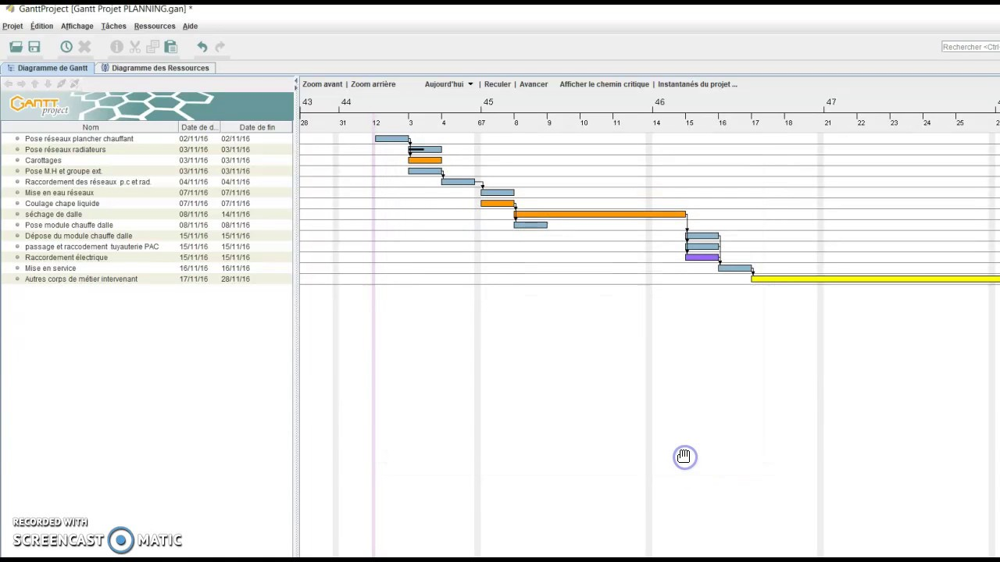

# PERT & Gantt – Planification de projet

## 1. Pourquoi planifier un projet ?

Planifier un projet permet de :
- organiser les tâches,
- anticiper les délais,
- identifier les points critiques,
- suivre l’avancement.

Après le WBS (quoi faire), la planification répond à la question :
> « Dans quel ordre et sur quelle durée ? »

## 2. Le diagramme PERT

### 2.1 Définition
Le **PERT (Program Evaluation and Review Technique)** est un outil qui permet de :
- représenter les tâches d’un projet,
- montrer leurs dépendances,
- identifier le chemin critique.

### 2.2 Notions clés
- **Tâche** : action à réaliser
- **Dépendance** : lien entre deux tâches
- **Durée** : temps estimé pour une tâche
- **Chemin critique** : suite de tâches qui détermine la durée minimale du projet

Toute tâche du chemin critique ne peut pas être retardée sans retarder le projet.

### 2.3 Exemple simple de dépendances

- La tâche B ne peut commencer que si la tâche A est terminée
- La tâche C peut se faire en parallèle de B

## 3. Le diagramme de Gantt

### 3.1 Définition
Le **diagramme de Gantt** est une représentation graphique :
- des tâches dans le temps,
- de leur durée,
- de leur enchaînement.

### 3.2 Différence PERT / Gantt

| Outil | Sert à |
|---|---|
| WBS | Découper le projet |
| PERT | Analyser les dépendances |
| Gantt | Planifier dans le temps |

## 4. GanttProject

**GanttProject** est un logiciel libre permettant de :
- créer un diagramme de Gantt,
- définir des dépendances,
- visualiser le chemin critique,
- suivre l’avancement d’un projet.

## 5. Lien entre WBS, PERT et Gantt

Un projet cohérent respecte la logique suivante :

1. WBS → structure le travail
2. PERT → organise les dépendances
3. Gantt → planifie dans le temps

Tout changement dans l’un doit être cohérent avec les autres.

## 6. Exemple de Gantt

Le lien pour télécharger le logiciel : https://www.ganttproject.biz/

